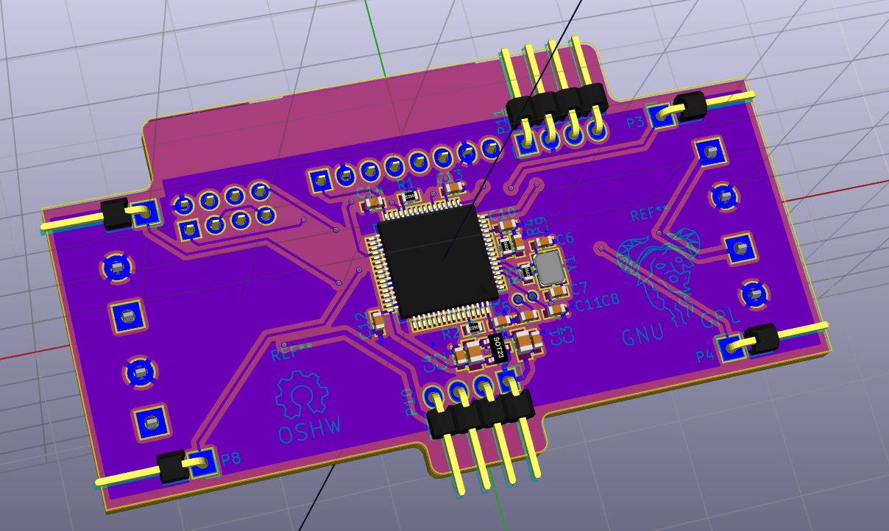
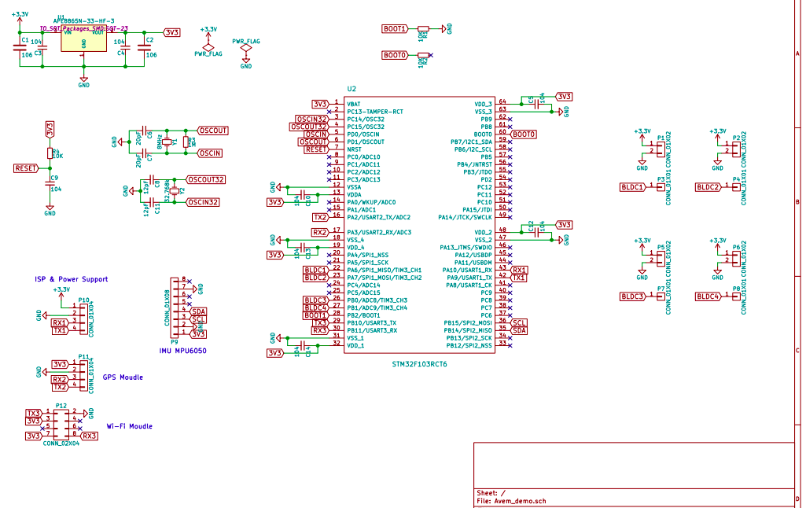

# Avem :bird:

[UAV] - [STM32F103] - 6 Axes sensor MPU6050 - Quaternion &amp; Euler Angles Compute - PID Controller

[Detials & Videos](http://bbs.5imx.com/forum.php?mod=viewthread&tid=1227960&extra=page%3D1)

# GPIO List
MPU6050 			| BLDC 			| Wi-Fi | GPS
:----:				|:----:			|:----: |:---:
**`SCL`** PB15	|**`CH1`** PA6	|**`USART3_TX`** PB10|*TBD*
**`SDA`** PB14	|**`CH2`** PA7	|**`USART3_RX`** PB11|*TBD*
					|**`CH3`** PB0
					|**`CH4`** PB1
# Todolist
 - [x] Software **I2C**
 - [x] Init **MPU6050**
 - [x] Get 3 axes `Gryo` and 3 axes `Accel` data from MPU6050
 - [x] Cumpute Quaternion and **Euler** Angles
 - [x] **PWM** output
 - [x] Driving motors with **L9110S**
 - [x] **PID** Control
 - [x] Schematic
 - [x] PCB Layout
 - [x] Brushless DC motor-[Video on YouTube](https://youtu.be/iHYVgTmxoSw)
 - [x] **Wi-Fi**(`ESP8266`)
 - [x] [PID](https://github.com/but0n/Avem/blob/master/pid.md)
 - [x] FreeRTOS
 - [ ] TCP/IP Socket connect with host
 - [ ] PID debug
 - [ ] **GPS**
 - [ ] 3D print or CNC cut
 - [ ] ... ...

----

# Hardware
> Old Version

> New Version

## 3D Moudle

## PCB Layout
Front

Back

## Schematic

