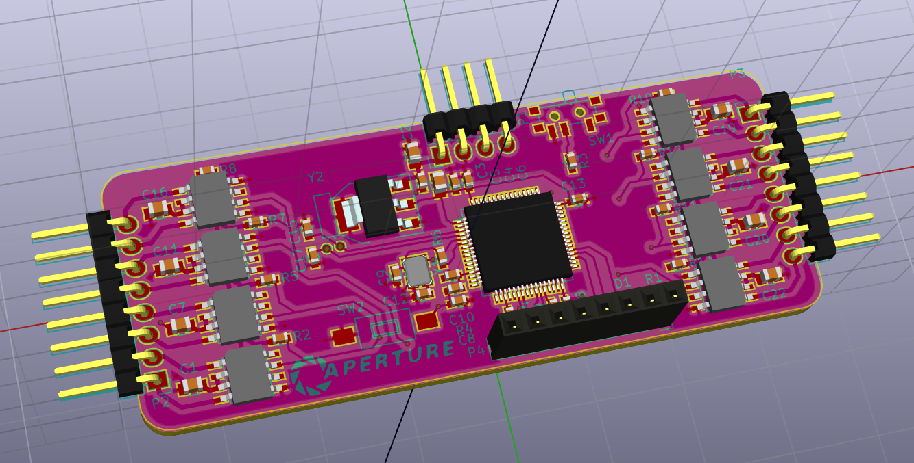
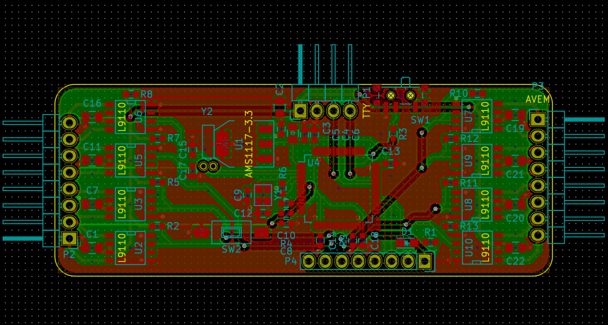
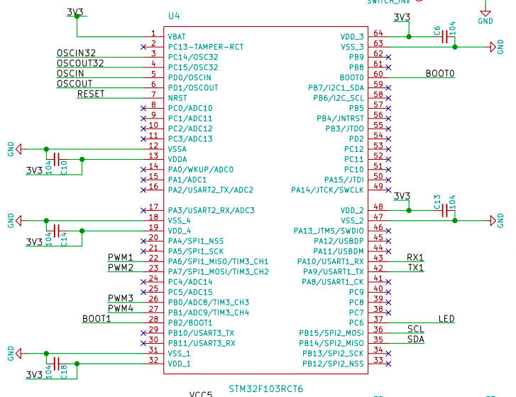
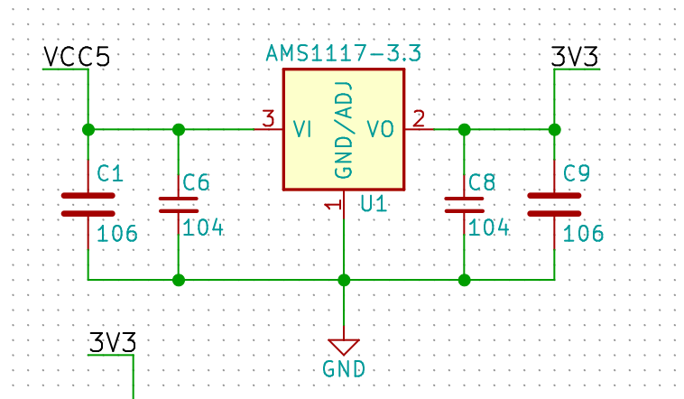
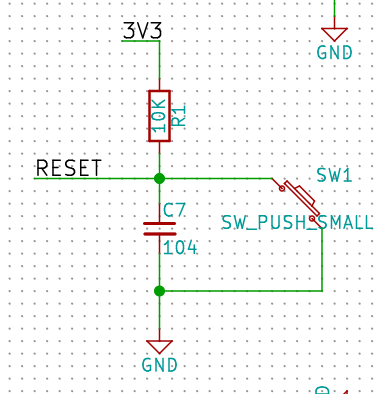
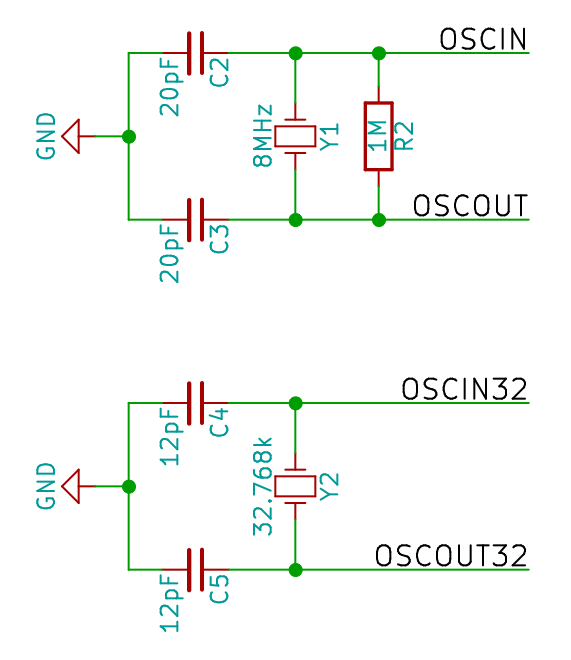
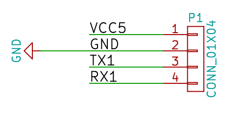
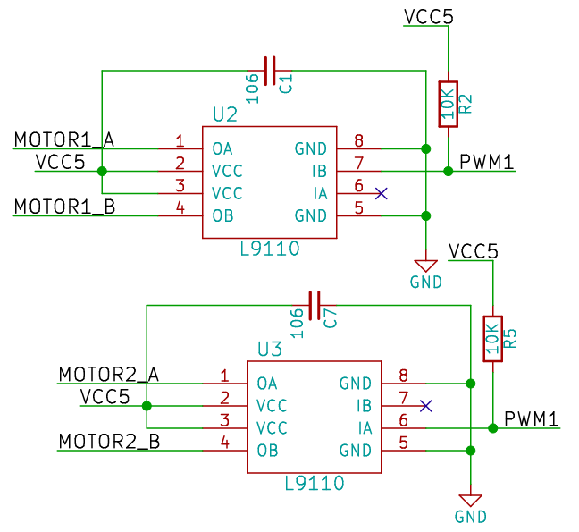
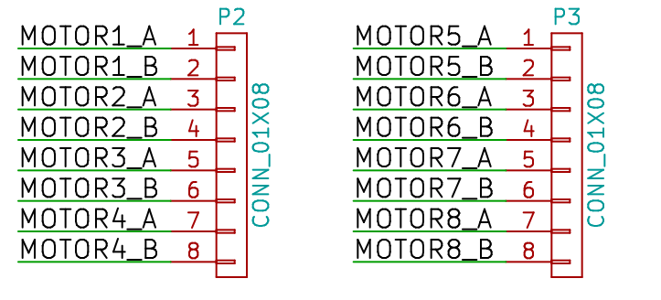

# Avem :bird:

[UAV] - [STM32F103] - 6 Axes sensor MPU6050 - Quaternion &amp; Euler Angles Compute - PID Controller

# GPIO
MPU6050 | BLDC | Wi-Fi | OLED Screen | LED
:------:|:----:|:-----:|:-----------:|:---
**`SCL`** PB15|**`PWM`** PA7|**`USART3_TX`** PB10|**`SDIN`** *TBD*|**`LED0`** PA8
**`SDA`** PB13||**`USART3_RX`** PB11|**`SCLK`** *TBD*|**`LED1`** PD2
**`AD0`** PC6	|||**`DC`** *TBD*
||||**`RST`** *TBD*
||||**`CS`** *TBD*

# Todolist
* Software **I2C**
* Init **MPU6050**
* Get 3 axes `Gryo` and 3 axes `Accel` data from MPU6050
* Cumpute Quaternion and **Euler** Angles
* **PWM** output
* Driving motors with **L9110S**
* **PID** Control
* Schematic
* PCB Layout (*Now I'm watting for PCB*)
* 使用PWM外接商品电调驱动无刷电机-[Video on YouTube](https://youtu.be/iHYVgTmxoSw)
* **Wi-Fi**(`ESP8266`)
	* PID debug
	* Design **frame**
	* **GPS**
	* 3D print or CNC cut
	* ... ...

----

# Software

:octocat:[but0n/MPU6050_stm32](https://github.com/but0n/MPU6050_stm32)

#Hardware

## 3D Moudle

## PCB Layout

## Schematic

### Microcontroller -- STM32F103

### 3.3v Power supply (DC2DC)

### RESET

### OSC

### USART In-System Programming

### Motor driver

### MPU6050

### MOTORS 4-CHANNEL LEFT & 4-CHANNEL RIGHT

