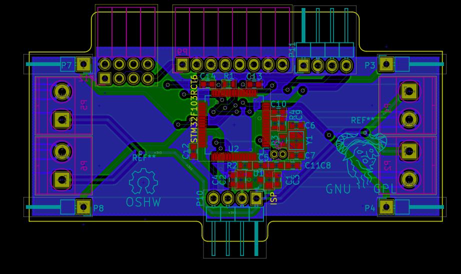

# Avem :bird:

[UAV] - [STM32F103] - 6 Axes sensor MPU6050 - Quaternion &amp; Euler Angles Compute - PID Controller

# GPIO List
MPU6050 | BLDC | Wi-Fi | LED
:------:|:----:|:-----:|:-----------:|:---
**`SCL`** PB15|**`PWM`** PA7|**`USART3_TX`** PB10|**`LED0`** PA8
**`SDA`** PB13||**`USART3_RX`** PB11|**`LED1`** PD2
**`AD0`** PC6	|

# Todolist
* Software **I2C**
* Init **MPU6050**
* Get 3 axes `Gryo` and 3 axes `Accel` data from MPU6050
* Cumpute Quaternion and **Euler** Angles
* **PWM** output
* Driving motors with **L9110S**
* **PID** Control
* Schematic
* PCB Layout
* Brushless DC motor-[Video on YouTube](https://youtu.be/iHYVgTmxoSw)
* **Wi-Fi**(`ESP8266`)
	* TCP/IP Socket connect with host
	* PID debug
	* **GPS**
	* 3D print or CNC cut
	* ... ...

----

# Software

:octocat:[but0n/MPU6050_stm32](https://github.com/but0n/MPU6050_stm32)

# Old Version Hardware

## 3D Moudle

## PCB Layout
New Version

## Schematic

