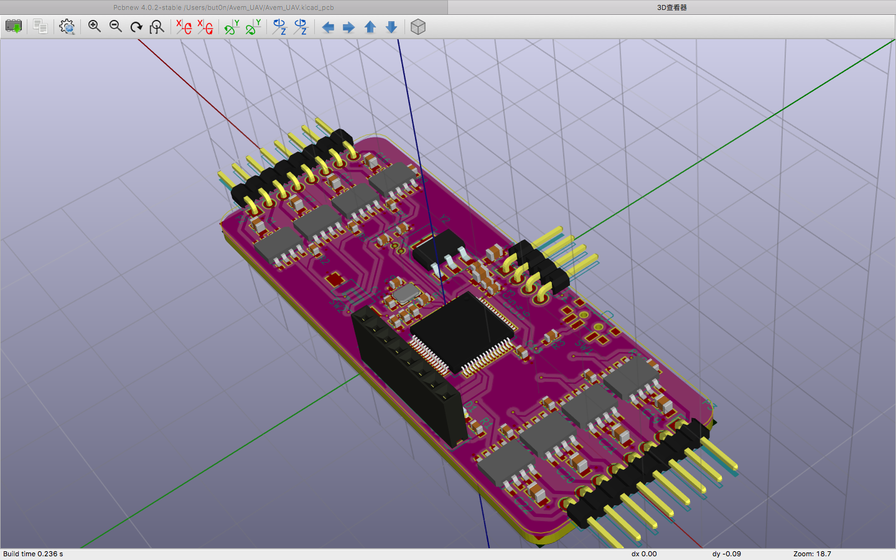
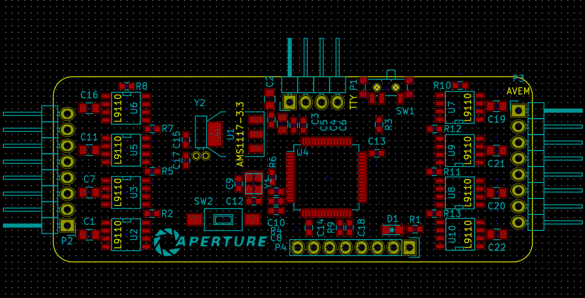
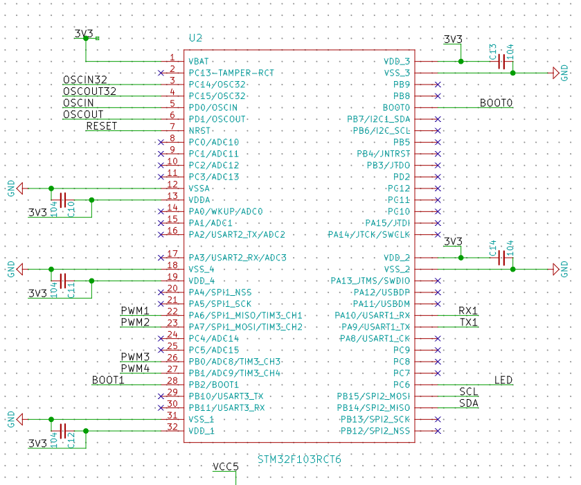

# Avem :bird:
[UAV] - [STM32F103] - 6 Axes sensor MPU6050 - Quaternion &amp; Euler Angles Compute - PID Controller

# Software

:octocat:[but0n/MPU6050_stm32](https://github.com/but0n/MPU6050_stm32)

#Hardware

## 3D Moudle

## PCB Layout

## Schematic

### Microcontroller -- STM32F103

### 3.3v Power supply (DC2DC)

### RESET

### OSC

### USART In-System Programming

### Motor driver

### MPU6050

### MOTORS

