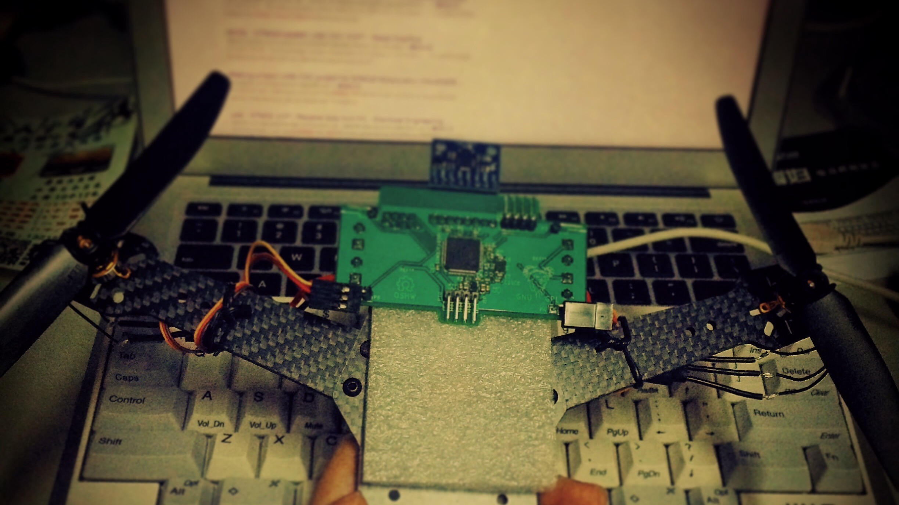
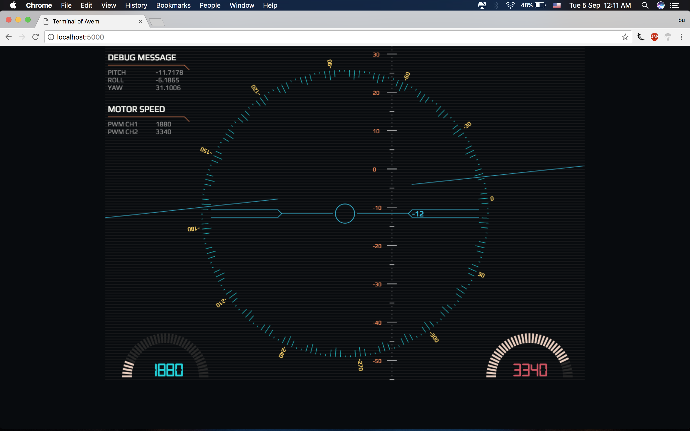
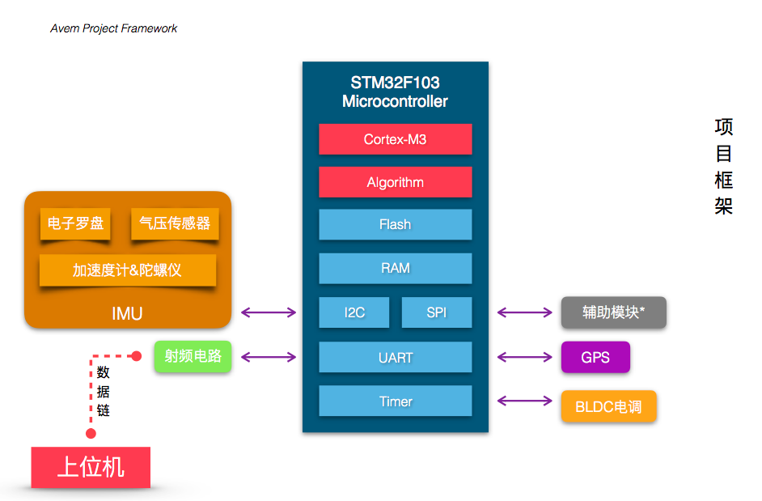
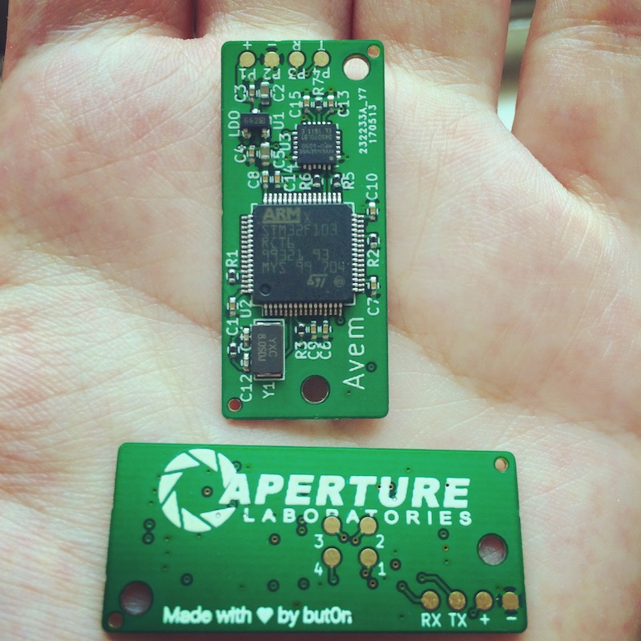
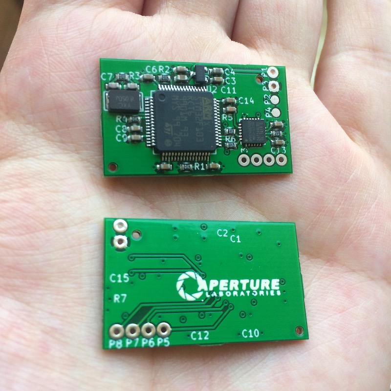
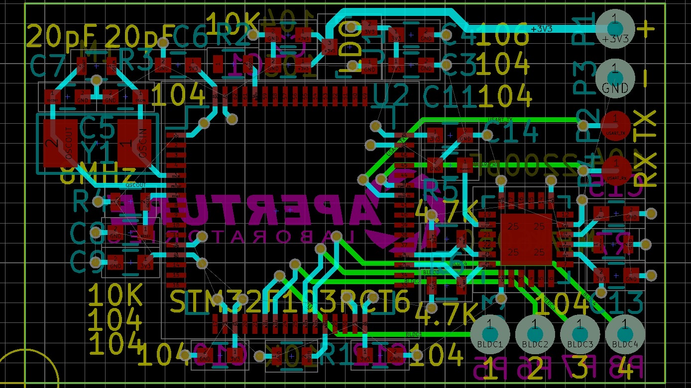

      
# Avem :bird:

[UAV] - [STM32F103] - 6 Axes sensor MPU6050 - Quaternion &amp; Euler Angles Compute - PID Controller

[Details & Videos](http://bbs.5imx.com/forum.php?mod=viewthread&tid=1227960&extra=page%3D1)

Terminal demo

https://github.com/but0n/Avem_HUD

# I/O List

MPU6050 			| BLDC 				| Wi-Fi 				| GPS
:----:				|:----:				|:----: 				|:---:
**`SCL`** PB15		|**`Channel 1`** PA6|**`USART3_TX`** PB10	|*TBD*
**`SDA`** PB14		|**`Channel 2`** PA7|**`USART3_RX`** PB11	|*TBD*
 ||**`Channel 3`** PB0| | |
 ||**`Channel 4`** PB1| | |

# To-do list

- [x] Software **I2C**
- [x] Init **MPU6050**
- [x] Get 3 axes `Gryo` and 3 axes `Accel` data from MPU6050
- [x] Cumpute Quaternion and **Euler** Angles
- [x] **PWM** output
- [x] Driving motors with **L9110S**
- [x] **PID** Control
- [x] Schematic
- [x] PCB Layout
- [x] Brushless DC motor-[Video via YouTube](https://youtu.be/iHYVgTmxoSw)
- [ ] **Wi-Fi**(`ESP8266`)
- [x] [Cascade PID control](https://github.com/but0n/Avem/blob/master/docs/README.md)
- [x] FreeRTOS
- [x] Host: Flask + pyserial
- [ ] PID debug
- [ ] **GPS**
- [ ] 3D print or CNC cut

# Hardware

## Schematic

## PCB Layout

Version 3.0

Version 2.0

[Documents](docs/)

Made with ♥ by but0n
